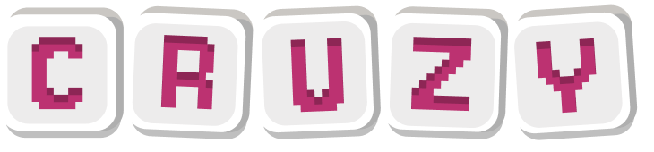

# Cruzy - Palavras Cruzadas Online



Disponível em: https://mint-ample-dodo.ngrok-free.app/

Utilize inteligência artificial para desenvolver suas próprias cruzadas e explorar uma ampla gama de opções personalizadas para você.  

## 📋 Índice

- [Sobre o Projeto](#sobre-o-projeto)
- [Tecnologias Utilizadas](#tecnologias-utilizadas)
- [Funcionalidades](#funcionalidades)
- [Como Executar o Projeto Localmente](#como-executar-o-projeto-localmente)
- [Estrutura do Projeto](#estrutura-do-projeto)
- [Arquitetura do Código](#arquitetura-do-código)
- [Como Contribuir](#como-contribuir)
- [Licença](#licença)

## Sobre o Projeto

Cruzy é uma plataforma web para jogar palavras cruzadas online com temas personalizados por IA. Este projeto foi desenvolvido com Node.js e oferece uma experiência interativa para os amantes de jogos de palavras. Com a inteligência artificial, é possível jogar em diversos níveis de dificuldade e temas variados, tornando o jogo divertido e educativo.

### Equipe de Desenvolvimento

- **Bianca Paes** @bianca-bpas
- **Emanuel Pedroza** @pdrzxzz
- **João Pontes** @pontesjpp
- **Letícia Andrade** @andrxmedy
- **Luma Rios** @lumarf
- **Vitor Lacerda**

## Tecnologias Utilizadas

- Node.js
- Express.js
- Passport.js
- HTML5
- CSS3
- JavaScript
- Pug.js
- Bootstrap
- Fabric.js
- Mongoose
- MongoDB
- OpenAI API
- Jest
- Render

## Funcionalidades

- Cadastro e login de usuários
- Jogos de palavras cruzadas interativos
- Tema personalizado com IA
- Modo de Jogo SinglePlayer com histórico de salas
- Interface responsiva para desktop e dispositivos móveis

## Como Executar o Projeto Localmente

1. Certifique-se de ter o Node.js instalado em seu computador
   ```bash
   node --version
   ```

2. Clone o repositório do projeto
   ```bash
   git clone https://github.com/pdrzxzz/Projeto-Cruzy.git
   ```

3. Acesse o diretório do projeto
   ```bash
   cd Projeto-Cruzy
   ```

4. Instale todas as dependências necessárias
   ```bash
   npm install
   ```

5. Instale o Nodemon globalmente (para desenvolvimento)
   ```bash
   npm install nodemon -g
   ```

6. Solicite as variáveis de ambiente necessárias (conforme arquivo .env.example) aos criadores do projeto.

7. Crie um arquivo .env na raiz do diretório e preencha com as informações recebidas.
   
8. Execute o script.
   ```bash
   npm run start
   ```
   *Caso não funcione você pode tentar:*
   ```bash
   nodemon app.js
   ```
   
9. Após iniciar o servidor, acesse o aplicativo em seu navegador:
[http://localhost:33322](http://localhost:33322)

## Estrutura do Projeto

```
Projeto-Cruzy/
├── config/
├── controllers/         # Controladores da aplicação
├── models/              # Modelos de dados (MongoDB)
├── public/              # Arquivos estáticos
│   ├── css/             # Estilos CSS
│   ├── js/              # Scripts JavaScript do cliente
│   └── images/          # Imagens e mídias
├── routes/              # Rotas da aplicação
├── views/               # Templates Pug
│   ├── layouts/         # Layouts base
│   ├── partials/        # Componentes parciais
│   ├── rooms/           # Views relacionadas às salas
│   └── users/           # Views relacionadas aos usuários
├── middleware.js        # Funções de middleware
├── app.js               # Arquivo principal da aplicação
├── package.json         # Configurações e dependências
└── README.md            # Documentação do projeto
```

## Arquitetura do Código

### Backend

#### Estrutura MVC
O projeto segue uma arquitetura Model-View-Controller (MVC):
- **Models**: Define os esquemas e modelos de dados usando Mongoose para MongoDB
- **Views**: Renderiza as interfaces usando templates Pug
- **Controllers**: Contém a lógica de negócios e manipulação de dados

#### Principais Componentes

1. **app.js**: Ponto de entrada da aplicação
   - Configura middleware, rotas e conexão com MongoDB
   - Inicializa o mecanismo de autenticação usando Passport.js

2. **models/**
   - **user.js**: Define o modelo de usuário e gerencia autenticação
   - **room.js**: Gerencia salas de jogo com esquema para tema, palavras e configurações

3. **controllers/**
   - **users.js**: Gerencia login, registro e autenticação
   - **rooms.js**: Manipula criação, exclusão e acesso às salas
   - **index.js**: Controla rotas principais

4. **routes/**
   - Define e organiza os endpoints da API e rotas da aplicação

### Frontend

1. **public/js/**
   - **Game.js**: Classe principal que gerencia a lógica do jogo
   - **createCrossword.js**: Algoritmo para criação do tabuleiro de palavras cruzadas
   - **displayGame.js**: Renderiza o jogo usando Fabric.js para canvas interativo

2. **views/**
   - Templates Pug organizados por funcionalidade
   - Sistema de layouts e partials para reutilização de código

### Integração com IA

- **controllers/rooms.js**: Integra com a API da OpenAI para gerar palavras cruzadas com temas personalizados
- O sistema envia prompts específicos para a API e processa as respostas para criar os jogos

### Sistema de Autenticação

- Implementado usando Passport.js com estratégia local
- Gerenciamento de sessões via MongoDB para persistência

### Fluxo de Dados

1. Usuário se autentica → passport-local valida
2. Usuário cria uma sala → OpenAI gera palavras e dicas
3. Sistema gera o tabuleiro → algoritmo de palavras cruzadas otimiza layout
4. Usuário joga → interação via Fabric.js e validação em tempo real

## Como Contribuir

1. Faça um fork do projeto
2. Crie uma nova branch com a sua feature: `git checkout -b minha-feature`
3. Commit suas mudanças: `git commit -m 'feat: Minha nova feature'`
4. Push para a branch: `git push origin minha-feature`
5. Abra um Pull Request

## Documentação

Para mais detalhes, consulte nossa [Documentação Oficial](https://docs.google.com/document/d/1JyKNSJcvwg3tDUKqbK3uDbGl7hSoqT--c2qsRwEY06o/edit?usp=drive_link).

## Licença

Este projeto está sob a licença MIT. Veja o arquivo [LICENSE](LICENSE) para mais detalhes.


